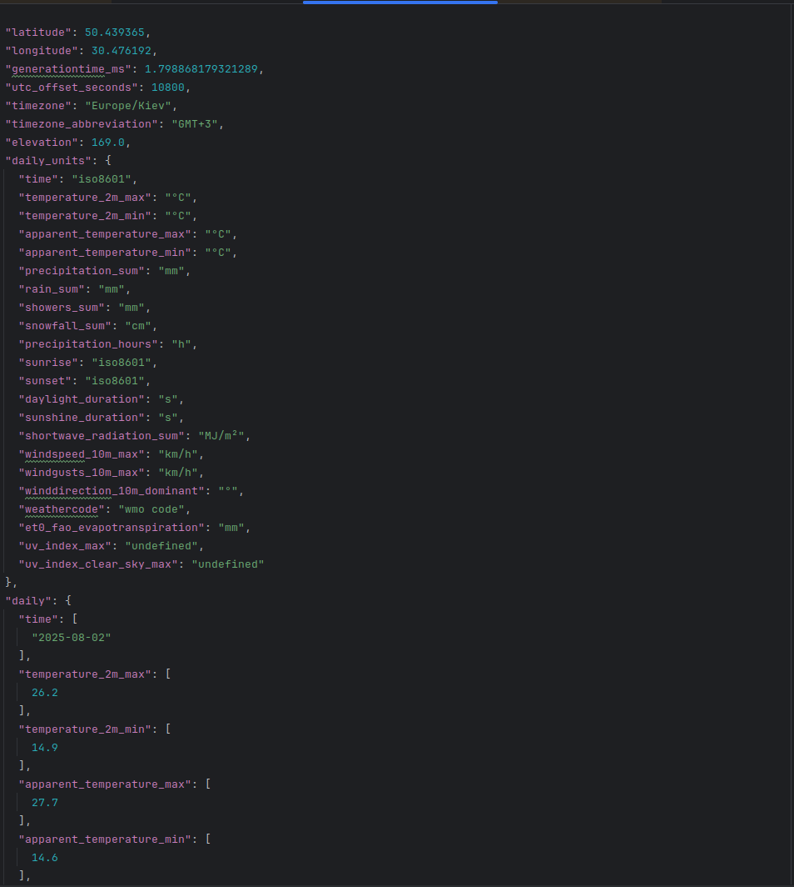
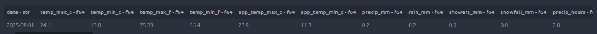
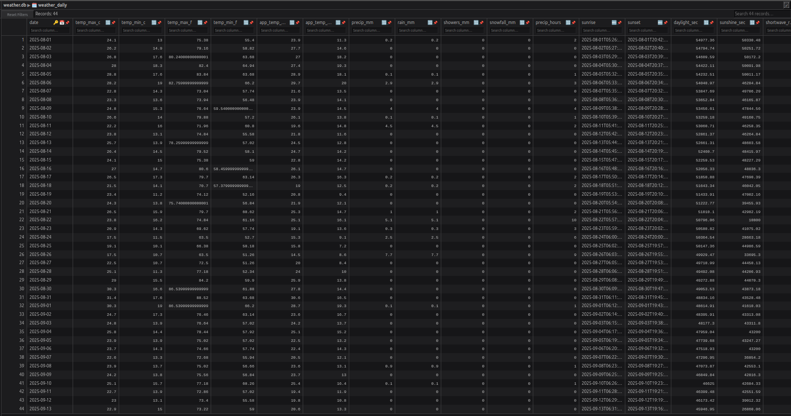
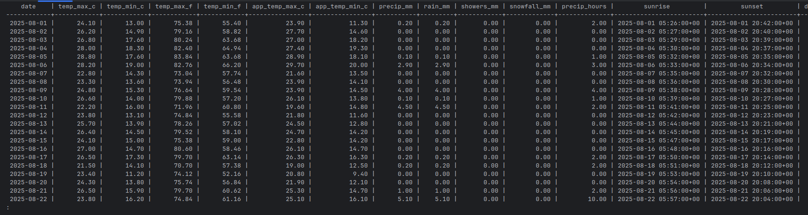
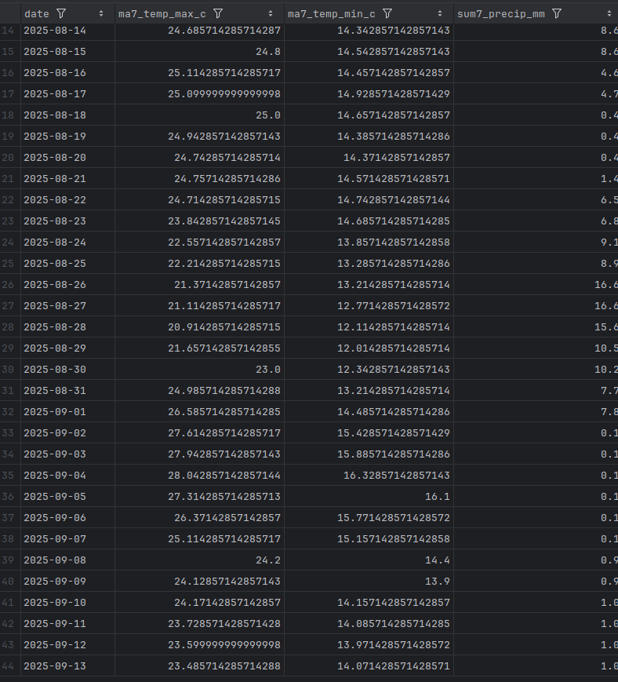
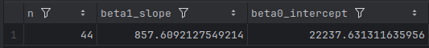

# CHI Data Weather Pipeline

The **CHI Data Weather Pipeline** is an end-to-end Extract → Transform → Load → Analytics (ETL+A) workflow that ingests historical weather observations from the [Open-Meteo Archive API](https://open-meteo.com/), stores raw and processed artefacts locally, populates a relational database, and generates analytical reports that highlight trends and environmental relationships.

This document provides an in-depth guide to the project, including architecture, dependencies, configuration, running instructions, and details about each output.

## Table of Contents

1. [Project Goals](#project-goals)  
2. [Data Sources](#data-sources)  
3. [Project Layout](#project-layout)  
4. [Component Overview](#component-overview)  
   - [Configuration (`src/config.py`)](#configuration-srcconfigpy)  
   - [Extract (`src/extract.py`)](#extract-srcextractpy)  
   - [Transform (`src/transform.py`)](#transform-srctransformpy)  
   - [Load (`src/load.py`)](#load-srcloadpy)  
   - [Analytics (`src/analytics.py`)](#analytics-srcanalyticspy)  
   - [Utilities (`src/utils/`)](#utilities-srcutil)  
5. [Architecture Overview](#architecture-overview)  
6. [Database Schema](#database-schema)  
7. [Data Dictionary](#data-dictionary)  
8. [Dependencies](#dependencies)  
9. [Configuration & Environment Variables](#configuration--environment-variables)  
10. [Setting Up the Environment](#setting-up-the-environment)  
   - [SQLite workflow](#sqlite-workflow)  
   - [PostgreSQL workflow](#postgresql-workflow)  
   - [Selective stage execution](#selective-stage-execution)  
11. [Generated Artefacts](#generated-artefacts)  
12. [Analytics Outputs](#analytics-outputs)  
13. [Supporting Tools & CLI](#supporting-tools--cli)  
14. [Testing](#testing)  
15. [Troubleshooting](#troubleshooting)  
16. [Extending the Project](#extending-the-project)  
17. [Contributing](#contributing)

---

## Project Goals

- Automate collection of daily historical weather data for a configurable geographic location.  
- Store raw API responses and cleaned parquet files for reproducibility and downstream analysis.  
- Guarantee idempotent database writes via SQL UPSERT statements.  
- Provide post-load analytics that compute rolling metrics, identify heatwaves, and correlate sunshine with temperature.  
- Document the workflow thoroughly and provide reproducible unit tests.

## Data Sources

The pipeline uses the **Open-Meteo Archive API**, which serves historical weather observations at daily granularity.

- Base endpoint: `https://archive-api.open-meteo.com/v1/archive`  
- Parameters include coordinates, date range, timezone, and requested variables.  
- The project fetches a comprehensive list of daily metrics (see `config.ALL_DAILY_VARS`).  
- If the API rejects certain variables (e.g., for specific regions or plan limitations), the extractor automatically retries and logs the unsupported metrics.

All data is saved locally; the project does not upload or share these datasets externally.

## Project Layout

```
CHI_Data/
├─ README.md
├─ Makefile
├─ pyproject.toml
├─ data/                      # runtime raw/parquet/report outputs (gitignored)
├─ db/                        # SQLite database & CSV exports (gitignored)
├─ resources/
│  └─ sql/                   # schema & analytics SQL scripts (backend-specific)
├─ src/
│  ├─ config.py
│  ├─ extract.py
│  ├─ transform.py
│  ├─ load.py
│  ├─ analytics.py
│  ├─ dump_db.py
│  ├─ pipeline.py
│  └─ utils/
│     ├─ io.py
│     ├─ logging.py
│     └─ schema.py
└─ tests/                     # unit tests covering core functions
```

## Component Overview

### Configuration (`src/config.py`)

- `PipelineConfig.from_env()` builds configuration from environment variables, providing sensible defaults for coordinates (`Kyiv, Ukraine`), date range (`2025-08-01` → `2025-09-13`), timezone (`Europe/Kyiv`), and directories.  
- Defines output directories: raw data (`data/raw`), processed parquet (`data/processed`), reports (`data/reports`), and database roots (`db/sqlite`, `db/pg`).  
- Exposes `ALL_DAILY_VARS` (the canonical daily metrics to request from Open-Meteo).  
- `METRIC_SQL_FILES` lists analytics SQL scripts executed after the load phase.

### Extract (`src/extract.py`)

- Handles API requests with robust retry/backoff via `requests` and `urllib3.Retry`.  
- Splits the date range into user-configurable batches (`PIPELINE_FETCH_BATCH_DAYS`).  
- Automatically identifies unsupported variables from error messages, removes them, and retries.  
- Yields metadata about requested/accepted/dropped metrics along with iterators for each JSON response chunk.

### Transform (`src/transform.py`)

- `transform_day_payload` flattens a single-day slice of the API response, applies numeric clipping and renames fields according to `utils/schema.FIELD_MAP`.  
- Derives Fahrenheit temperatures from Celsius inputs.  
- `transform_to_dataframe` returns a single-row pandas `DataFrame` and ensures sunrise/sunset columns become timezone-aware timestamps.

### Load (`src/load.py`)

- `get_db_engine` builds a SQLAlchemy engine for SQLite (default file under `db/sqlite/weather.db`) or PostgreSQL (using environment variables or overrides via `.env`).  
- `ensure_db_and_table` executes backend-specific schema scripts to guarantee the `weather_daily` table exists.  
- `split_save_and_upsert` processes each day: saves raw JSON, saves parquet, prepares parameters (`df_rows_for_upsert`), and executes the UPSERT SQL.  
- UPSERT behaviour is defined in `resources/sql/sqlite/upsert_weather_daily.sql` or `resources/sql/pg/upsert_weather_daily.sql`.

### Analytics (`src/analytics.py`)

- Accepts a list of SQL filenames (`METRIC_SQL_FILES` by default).  
- Executes each query using pandas `read_sql_query`, then writes both JSON and CSV outputs plus a summary manifest (`metadata.json`).  
- Report directories are timestamped (UTC) and stored under `data/reports/`.

### Utilities (`src/utils/`)

- `io.py`: safe directory creation, SQL file loader respecting backend-specific subfolders, custom JSON serialiser, and UTC timestamp helper.  
- `logging.py`: standardized logging configuration used by the pipeline entry point.  
- `schema.py`: numeric clipping logic plus mapping from API fields to cleaned column names.

## Architecture Overview

### High-Level Flow

```
┌────────────┐     ┌────────────┐     ┌────────────┐     ┌────────────┐     ┌─────────────┐
│  Extract   │ ==> │ Transform  │ ==> │    Load    │ ==> │  Analytics │ ==> │   Reports    │
│ API → JSON │     │ JSON → DF  │     │ UPSERT DB  │     │ SQL → DF   │     │ CSV / JSON   │
└─────┬──────┘     └────┬───────┘     └────┬───────┘     └────┬───────┘     └──────┬──────┘
      │                 │                 │                 │                    │
      ▼                 ▼                 ▼                 ▼                    ▼
 data/raw/        data/processed/     db/<backend>/   data/reports/      metadata.json
```

- **Extract**: retrieves daily archives from Open-Meteo in manageable date chunks.  
- **Transform**: validates and reshapes a single-day payload into a tabular structure.  
- **Load**: writes artefacts (raw/parquet) and UPSERTs rows into `weather_daily`.  
- **Analytics**: executes SQL queries, producing CSV/JSON outputs and a manifest.

### Sequence of Operations

1. Read configuration from environment (`PipelineConfig`).  
2. Iterate date windows via `_iter_date_chunks`; issue HTTP GETs with retry/backoff.  
3. Immediately persist raw responses to `data/raw/`.  
4. Build a canonical mapping for the day (`transform_day_payload`) and serialise to parquet.  
5. Prepare UPSERT parameters with strict type handling (`df_rows_for_upsert`).  
6. Execute analytics SQL scripts to generate aggregated datasets.  
7. Write CSV/JSON alongside `metadata.json` describing report contents.

## Database Schema

The `weather_daily` table (materialised via `resources/sql/<backend>/init.sql`) contains the following columns:

| Column | Type (SQLite) | Description |
|--------|---------------|-------------|
| `date` | TEXT PRIMARY KEY | Observation date (ISO 8601). |
| `temp_max_c`, `temp_min_c` | REAL | Minimum/maximum air temperature (°C). |
| `temp_max_f`, `temp_min_f` | REAL | Fahrenheit conversions derived in-transform. |
| `app_temp_max_c`, `app_temp_min_c` | REAL | Apparent (feels-like) temperatures. |
| `precip_mm`, `rain_mm`, `showers_mm`, `snowfall_mm` | REAL | Precipitation totals (mm). |
| `precip_hours` | REAL | Hours with measurable precipitation. |
| `sunrise`, `sunset` | TEXT | ISO timestamps for sunrise/sunset (UTC). |
| `daylight_sec`, `sunshine_sec` | REAL | Total daylight/sunshine seconds. |
| `shortwave_radiation_mj_m2` | REAL | Daily solar radiation exposure. |
| `wind_max_kmh`, `wind_gust_max_kmh` | REAL | Wind speed metrics (km/h). |
| `wind_dir_deg` | REAL | Dominant wind direction (degrees). |
| `weather_code` | INTEGER | Open-Meteo weather condition code. |
| `et0_mm` | REAL | FAO Penman-Monteith evapotranspiration (mm). |
| `uv_index_max`, `uv_index_clear_sky_max` | REAL | UV index statistics. |
| `source` | TEXT | Data source identifier (`open-meteo`). |
| `ingested_at` | TEXT | UTC timestamp of pipeline ingestion. |

> PostgreSQL schemas mirror these columns but leverage native types (`DATE`, `TIMESTAMPTZ`, etc.).

### UPSERT Semantics

The UPSERT statement uses `INSERT ... ON CONFLICT (date) DO UPDATE` so rerunning the pipeline for overlapping dates refreshes existing rows instead of creating duplicates.

For reference, the SQLite schema (truncated for brevity) looks like:

```sql
CREATE TABLE IF NOT EXISTS weather_daily (
    date TEXT PRIMARY KEY,
    temp_max_c REAL,
    temp_min_c REAL,
    -- ... additional columns ...
    uv_index_clear_sky_max REAL,
    source TEXT NOT NULL,
    ingested_at TEXT NOT NULL
);
```

## Data Dictionary

While `FIELD_MAP` in `src/utils/schema.py` provides the authoritative mapping, the table below summarises the most important output fields:

| Field | Units | Description | Source |
|-------|-------|-------------|--------|
| `temp_max_c` / `temp_min_c` | °C | Daily maximum/minimum temperature. | Open-Meteo `temperature_2m_max/min`. |
| `temp_max_f` / `temp_min_f` | °F | Converted Fahrenheit values. | Derived in transform stage. |
| `app_temp_max_c` / `app_temp_min_c` | °C | Apparent (feels-like) temperatures. | Open-Meteo `apparent_temperature_*`. |
| `precip_mm`, `rain_mm`, `showers_mm`, `snowfall_mm` | mm | Liquid/solid precipitation totals. | Open-Meteo precipitation metrics. |
| `precip_hours` | hours | Duration of precipitation events. | Open-Meteo `precipitation_hours`. |
| `sunrise`, `sunset` | ISO datetime | UTC timestamps for sunrise/sunset. | Open-Meteo `sunrise/sunset`. |
| `daylight_sec`, `sunshine_sec` | seconds | Total daylight and sunshine exposure. | Open-Meteo `daylight_duration`, `sunshine_duration`. |
| `shortwave_radiation_mj_m2` | MJ/m² | Daily solar irradiance. | Open-Meteo `shortwave_radiation_sum`. |
| `wind_max_kmh`, `wind_gust_max_kmh` | km/h | Peak wind speed and gusts. | Open-Meteo `windspeed_10m_max`, `windgusts_10m_max`. |
| `wind_dir_deg` | degrees | Dominant wind direction. | Open-Meteo `winddirection_10m_dominant`. |
| `weather_code` | code | Condition code following Open-Meteo taxonomy. | Open-Meteo `weathercode`. |
| `et0_mm` | mm | FAO Penman-Monteith evapotranspiration. | Open-Meteo `et0_fao_evapotranspiration`. |
| `uv_index_max`, `uv_index_clear_sky_max` | index | UV metrics (max & clear-sky). | Open-Meteo `uv_index_*`. |
| `source` | string | Hard-coded to `open-meteo`. | Pipeline constant. |
| `ingested_at` | ISO datetime | UTC timestamp of ingestion. | Generated at load time. |

Additional derived columns can be added by modifying `FIELD_MAP` and updating this dictionary accordingly.

## Dependencies

Core Python dependencies (declared in `pyproject.toml`):

- [`requests`](https://docs.python-requests.org/) and [`urllib3`](https://urllib3.readthedocs.io/) for HTTP interactions with retry support.  
- [`pandas`](https://pandas.pydata.org/), [`numpy`](https://numpy.org/), and [`pyarrow`](https://arrow.apache.org/docs/python/) for data wrangling and parquet writes.  
- [`SQLAlchemy`](https://www.sqlalchemy.org/) and [`psycopg2-binary`](https://www.psycopg.org/) for relational access.  
- Python ≥ 3.12.  
- Recommended package manager: [Poetry](https://python-poetry.org/) for reproducible environments.

Optional tooling:

- [Docker](https://www.docker.com/) and Docker Compose to run PostgreSQL locally.  
- [`make`](https://www.gnu.org/software/make/) for the provided automation targets.  
- [`sqlite3`](https://www.sqlite.org/cli.html) or any SQL client to inspect databases.

## Configuration & Environment Variables

| Variable | Purpose | Default |
|----------|---------|---------|
| `PIPELINE_LATITUDE`, `PIPELINE_LONGITUDE` | target coordinates | 50.45, 30.52 |
| `PIPELINE_START_DATE`, `PIPELINE_END_DATE` | inclusive date range | `2025-08-01` → `2025-09-13` |
| `PIPELINE_TIMEZONE` | timezone requested from API | `Europe/Kyiv` |
| `PIPELINE_FETCH_BATCH_DAYS` | days per API call (`0` = full range) | 30 |
| `PIPELINE_DB_BACKEND` | `sqlite` or `postgres` | `sqlite` |
| `PIPELINE_DB_URL` | optional SQLAlchemy URL (Postgres) | blank |
| `POSTGRES_HOST`, `POSTGRES_PORT`, `POSTGRES_DB`, `POSTGRES_USER`, `POSTGRES_PASSWORD` | Postgres connection details | `localhost`, `5432`, `weather`, `weather`, _(empty)_ |

Environment variables can be placed in `.env`. The Makefile automatically sources this file before executing Python commands.

## Setting Up the Environment

1. **Clone the repository**:
   ```bash
   git clone <repo-url>
   cd CHI_Data
   ```

2. **Install dependencies** (using Poetry for illustration):
   ```bash
   poetry install
   poetry shell
   ```
   Alternatively, use `python -m venv` and `pip install` with the dependencies listed in `pyproject.toml`.

3. **Optional**: create a `.env` file to override defaults (e.g., change date range or backend).

## Running the Pipeline

### SQLite Workflow

The simplest execution uses SQLite and requires no external services:

```bash
make pipeline-sqlite
```

This command:
- Reads environment variables and builds a `PipelineConfig`.  
- Fetches historical weather data from Open-Meteo in batches.  
- Saves raw JSON (`data/raw/DDDD-.../response.json`). 

- Writes cleaned parquet (`data/processed/.../data.parquet`).

- UPSERTs into `db/sqlite/weather.db`.  
- Executes configured SQL analytics and produces reports under `data/reports/<timestamp>/`.




### PostgreSQL Workflow

Use Docker Compose to run a Postgres container (definition in `docker-compose.yml`):

```bash
make pipeline-postgres
```

This target:
1. Starts the Postgres container (`make start-postgres`).  
2. Runs the pipeline with `PIPELINE_DB_BACKEND=postgres`.  
3. Stops the container afterwards (`make stop-postgres`).



To keep Postgres running across multiple pipeline runs:

```bash
make start-postgres
make pipeline DB=postgres      # or python src/pipeline.py
make start-postgres-logs       # optional: follow container logs
make stop-postgres
```

When finished, remove the containers and volumes:

```bash
make drop-postgres
```

### Selective Stage Execution

- **Analytics only**: run `python -m src.analytics` with a pre-existing database and configure queries.  
- **Data dump**: `make dump-sqlite` or `make dump-postgres` exports the `weather_daily` table to timestamped CSV in `db/sqlite/` or `db/pg/`.  
- **Clean-up**: `make clean-sqlite`, `make clean-data`, `make clean-postgres`, or `make clean-all`.

## Generated Artefacts

| Location | Description |
|----------|-------------|
| `data/raw/YYYY-MM-DD/response.json` | Raw API payload for each day |
| `data/processed/YYYY-MM-DD/data.parquet` | Cleaned single-row dataset per day |
| `db/sqlite/weather.db` | SQLite database containing `weather_daily` |
| `db/sqlite/*.csv` | Table exports created via `dump_db.py` |
| `data/reports/<timestamp>/` | Analytics outputs (`*.json`, `*.csv`, `metadata.json`) |

PostgreSQL data resides in the container volume or the database specified by `PIPELINE_DB_URL`.

## Analytics Outputs

Default SQL reports (`src/config.METRIC_SQL_FILES`):

1. `metrics_rolling_7d.sql`: aggregated rolling averages, precipitation, radiation, etc. 

2. `metrics_heatwave_streaks.sql`: identifies consecutive days exceeding temperature thresholds.  

3. `metrics_sunshine_vs_temp.sql`: analyses relationships between sunshine duration and temperatures (e.g., regression slope/coefficient).  


Each report includes both JSON and CSV files plus an entry in `metadata.json` summarising dataset names and row counts. Modify or add SQL scripts in `resources/sql/<backend>/` and update `METRIC_SQL_FILES` as needed.

Example `metadata.json` snippet:

```json
{
  "generated_utc": "2025-09-16T20:35:41Z",
  "metrics": [
    {"name": "rolling_7d_metrics", "rows": 44, "json": "rolling_7d_metrics.json", "csv": "rolling_7d_metrics.csv"},
    {"name": "heatwave_streaks", "rows": 3, "json": "heatwave_streaks.json", "csv": "heatwave_streaks.csv"}
  ]
}
```

## Supporting Tools & CLI

### Makefile Targets

- `make pipeline`, `make pipeline-sqlite`, `make pipeline-postgres`  
- `make dump`, `make dump-sqlite`, `make dump-postgres`  
- `make start-postgres`, `make start-postgres-logs`, `make stop-postgres`, `make drop-postgres`  
- `make clean-sqlite`, `make clean-postgres`, `make clean-data`, `make clean-all`  
- `make help` outlines all available targets.

### `dump_db.py`

CLI exporting `weather_daily` to CSV:

```bash
python src/dump_db.py --backend sqlite      # default output under db/sqlite/
python src/dump_db.py --backend postgres    # requires configured connection
```

### Pipeline Module

You can run the pipeline module directly:

```bash
python -m src.pipeline
```

## Testing

Run unit tests (no external dependencies required):

```bash
python -m unittest discover -s tests -p "test_*.py"
```

These tests cover configuration overrides, date chunking, transformation logic, JSON utilities, UPSERT parameter formatting, and analytics execution on a temporary SQLite database.

## Troubleshooting

- **`ModuleNotFoundError: No module named 'src'`**: run via the Makefile or ensure the project root is on `PYTHONPATH` (the scripts insert it automatically when executed as scripts).  
- **API errors**: confirm your date range is valid and network access is available. The extractor logs unsupported variables.  
- **SQLite database missing**: rerun `make pipeline-sqlite`; clean with `make clean-sqlite`.  
- **Postgres connection failed**: verify Docker is running, check `make start-postgres-logs`, and ensure credentials/host match actual configuration.  
- **`sqlalchemy.exc.OperationalError`**: indicates database connectivity issues—review logs and environment variables.  
- **Missing dependencies**: reinstall via `poetry install` or ensure the correct virtual environment is active.

## Extending the Project

- Add new analytics SQL scripts to `resources/sql/` and reference them in `METRIC_SQL_FILES`.  
- Integrate with cloud storage (S3, Azure Blob, GCS) by extending `utils.io`.  
- Introduce scheduling/orchestration (Prefect, Airflow, or GitHub Actions).  
- Use cron or other schedulers for periodic runs, e.g.:
  ```cron
  5 9 * * * cd /project && /usr/bin/python -m src.pipeline >> logs/run.log 2>&1
  ```
- Expand transformations or add quality checks (e.g., data validation frameworks such as Great Expectations).  
- Implement caching or incremental fetching strategies for large date ranges.  
- Explore additional API endpoints (hourly data, forecast data).

## Contributing

1. Fork the repository and clone locally.  
2. Install dependencies (Poetry or venv + pip).  
3. Create a feature branch (`git checkout -b feature/my-change`).  
4. Implement changes with docstrings and unit tests where appropriate.  
5. Run the test suite.  
6. Submit a pull request describing your modifications and include any relevant context/log outputs.

---

**Happy forecasting!** If you encounter issues or have suggestions, feel free to open an issue or propose improvements.
